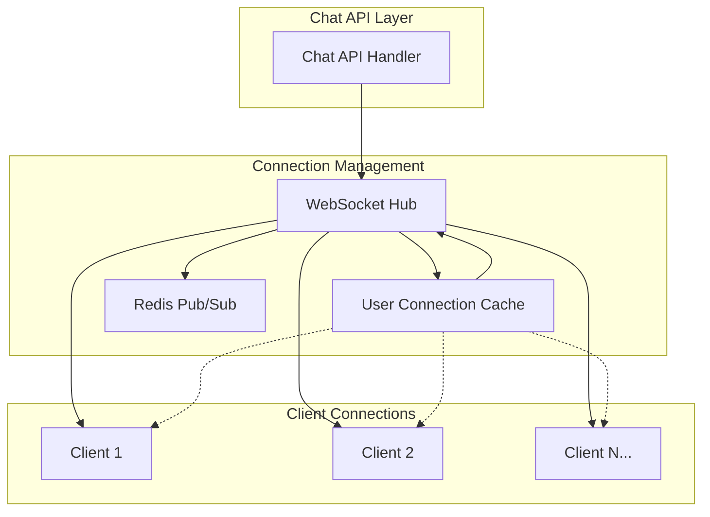
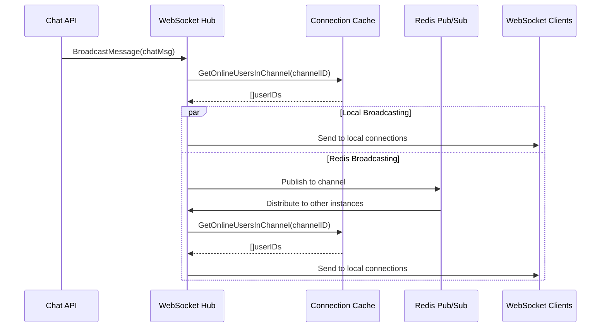

# Design Document: User Connection Cache

## Overview

The user connection cache system enhances the existing WebSocket hub architecture by providing efficient user presence management and optimized message broadcasting. The design builds upon the current `Hub` and `Client` structures while adding a dedicated connection cache layer that maintains real-time user state and enables targeted message distribution.

The system integrates seamlessly with the existing Redis pub/sub mechanism and WebSocket infrastructure, providing both local and cross-instance broadcasting capabilities.

## Architecture

### High-Level Architecture



### Connection Cache Architecture

The connection cache operates as a centralized registry that maintains:
- **User-to-Connection mapping**: Quick lookup of active connections by user ID
- **Channel-to-Users mapping**: Efficient retrieval of all users in a specific channel
- **Connection metadata**: Additional information about each connection (join time, last activity)

## Components and Interfaces

### 1. UserConnectionCache

The core component that manages all user connections and provides broadcasting capabilities.

```go
type UserConnectionCache struct {
    // userConnections maps user ID to their active client connection
    userConnections map[uint]*Client
    
    // channelUsers maps channel ID to set of user IDs subscribed to that channel
    channelUsers map[uint]map[uint]bool
    
    // connectionMetadata stores additional info about each connection
    connectionMetadata map[uint]*ConnectionMetadata
    
    // Thread safety
    mu sync.RWMutex
    
    // Reference to the hub for integration
    hub *Hub
}

type ConnectionMetadata struct {
    UserID       uint
    ConnectedAt  time.Time
    LastActivity time.Time
    Channels     map[uint]bool
}
```

### 2. Enhanced Hub Integration

The existing `Hub` struct will be extended to include the connection cache:

```go
type Hub struct {
    // Existing fields
    Clients    map[*Client]bool
    Register   chan *Client
    Unregister chan *Client
    Broadcast  chan ChannelMessage
    Redis      *redis.Client
    mu         sync.RWMutex
    
    // New field
    ConnectionCache *UserConnectionCache
}
```

### 3. Broadcasting Interface

New methods for targeted broadcasting:

```go
type Broadcaster interface {
    BroadcastToChannel(channelID uint, message []byte) error
    BroadcastToUser(userID uint, message []byte) error
    BroadcastToUsers(userIDs []uint, message []byte) error
    GetOnlineUsersInChannel(channelID uint) []uint
    GetOnlineUsers() []uint
    IsUserOnline(userID uint) bool
}
```

## Data Models

### Connection Cache Data Structures

1. **User Connection Map**
   ```go
   userConnections: map[uint]*Client
   // Key: User ID, Value: Client connection
   ```

2. **Channel Users Map**
   ```go
   channelUsers: map[uint]map[uint]bool
   // Key: Channel ID, Value: Set of User IDs
   ```

3. **Connection Metadata**
   ```go
   type ConnectionMetadata struct {
       UserID       uint              `json:"userId"`
       ConnectedAt  time.Time         `json:"connectedAt"`
       LastActivity time.Time         `json:"lastActivity"`
       Channels     map[uint]bool     `json:"channels"`
   }
   ```

### Message Broadcasting Flow



## Error Handling

### Connection Management Errors

1. **Stale Connection Detection**
   - Implement heartbeat mechanism to detect inactive connections
   - Automatic cleanup of stale connections from cache
   - Graceful handling of connection failures during broadcast

2. **Concurrent Access Protection**
   - Use read-write mutexes for optimal performance
   - Implement proper locking hierarchy to prevent deadlocks
   - Handle race conditions during connection registration/unregistration

3. **Broadcasting Failures**
   - Skip failed connections and remove them from cache
   - Log broadcast failures for monitoring
   - Implement retry mechanism for critical messages

### Error Recovery Strategies

```go
type ErrorHandler interface {
    HandleConnectionError(userID uint, err error)
    HandleBroadcastError(channelID uint, userID uint, err error)
    CleanupStaleConnections()
}
```

## Testing Strategy

### Unit Tests

1. **Connection Cache Operations**
   - Test user registration/unregistration
   - Test channel subscription/unsubscription
   - Test concurrent access scenarios
   - Test cache consistency

2. **Broadcasting Logic**
   - Test message delivery to online users
   - Test filtering of offline users
   - Test error handling during broadcast failures
   - Test Redis integration

### Integration Tests

1. **WebSocket Integration**
   - Test full message flow from API to client
   - Test multi-client scenarios
   - Test cross-instance communication via Redis
   - Test connection lifecycle management

2. **Performance Tests**
   - Load testing with multiple concurrent connections
   - Broadcasting performance with large user sets
   - Memory usage optimization
   - Cache lookup performance

### Test Data Setup

```go
type TestScenario struct {
    Users     []uint
    Channels  []uint
    Messages  []TestMessage
    Expected  []BroadcastResult
}

type TestMessage struct {
    ChannelID uint
    SenderID  uint
    Content   string
}
```

## Performance Considerations

### Optimization Strategies

1. **Cache Efficiency**
   - Use maps for O(1) lookup operations
   - Implement efficient data structures for channel-user relationships
   - Minimize memory allocations during broadcasting

2. **Concurrent Broadcasting**
   - Use goroutines for parallel message delivery
   - Implement connection pooling for Redis operations
   - Optimize mutex usage with read-write locks

3. **Memory Management**
   - Implement automatic cleanup of disconnected users
   - Use object pooling for frequently allocated structures
   - Monitor and limit cache size growth

### Scalability Metrics

- Support for 10,000+ concurrent connections
- Sub-100ms message delivery latency
- Efficient memory usage (< 1MB per 1000 connections)
- Horizontal scaling via Redis pub/sub

## Integration Points

### Existing Code Integration

1. **Hub Enhancement**
   - Extend `WsRun()` method to integrate with connection cache
   - Modify client registration/unregistration logic
   - Update broadcasting mechanism to use cache

2. **API Integration**
   - Enhance `BroadcastMessage()` method to use connection cache
   - Add new endpoints for user presence queries
   - Integrate with existing chat API handlers

3. **Redis Integration**
   - Maintain compatibility with existing Redis pub/sub
   - Add cache synchronization across instances
   - Implement distributed cache consistency

### Backward Compatibility

- All existing WebSocket functionality remains unchanged
- Current client connections continue to work
- Existing Redis pub/sub mechanism is preserved
- API endpoints maintain current behavior while adding new capabilities