# WebSocket Frontend Best Practices

This document provides comprehensive guidelines for implementing robust WebSocket connections on the frontend to work seamlessly with the improved backend WebSocket implementation.

## WebSocket Connection Flow Sequence Diagram

The following sequence diagram illustrates the complete WebSocket connection lifecycle, including initial connection, normal operations, disconnection scenarios, and reconnection flows.

```mermaid
sequenceDiagram
    participant FE as Frontend Client
    participant WS as WebSocket Manager
    participant BE as Backend Server
    participant HUB as WebSocket Hub
    participant REDIS as Redis Store

    Note over FE,REDIS: 1. INITIAL CONNECTION FLOW

    FE->>WS: connect(userId)
    WS->>WS: setState(CONNECTING)
    WS->>BE: WebSocket Upgrade Request<br/>GET /ws?userId=123

    alt Valid User ID
        BE->>BE: validateUserID(123)
        BE->>BE: Check WebSocket headers
        BE-->>WS: 101 Switching Protocols
        WS->>WS: setState(CONNECTED)

        BE->>HUB: register client
        HUB->>HUB: Check if user already online
        HUB->>REDIS: setUserOnline(123) [if first client]
        HUB->>WS: Connection Success Message<br/>{"type": "connection.connect", "data": {"client_id": "abc", "status": "connected"}}

        WS->>WS: startHeartbeat() [30s interval]
        WS->>WS: flushMessageQueue()
        WS->>FE: onConnected()

    else Invalid User ID
        BE-->>WS: 400 Bad Request<br/>{"error": "userId must be valid number"}
        WS->>WS: setState(FAILED)
        WS->>FE: onError(validation_error)
    end

    Note over FE,REDIS: 2. NORMAL MESSAGE EXCHANGE

    FE->>WS: joinChannel("channel-456")
    WS->>BE: {"type": "channel.join", "data": {"channel_id": "channel-456"}}
    HUB->>HUB: validateChannelPermissions()
    HUB->>HUB: addClientToChannel()
    HUB->>REDIS: joinChannel(userId, channelId)
    HUB->>WS: {"type": "channel.join", "data": {"channel_id": "channel-456", "status": "joined"}}
    WS->>FE: onChannelJoined()

    FE->>WS: sendMessage("Hello World!")
    WS->>BE: {"type": "channel.message", "data": {"channel_id": "channel-456", "text": "Hello World!"}}
    HUB->>HUB: validateMessage()
    HUB->>HUB: checkRateLimit()
    HUB->>HUB: saveToDatabase()
    HUB->>REDIS: publishChannelMessage()
    REDIS->>HUB: broadcastToChannel()
    HUB->>WS: {"type": "channel.message", "data": {...}}
    WS->>FE: onMessageReceived()

    Note over FE,REDIS: 3. HEARTBEAT MECHANISM

    loop Every 30 seconds
        WS->>BE: {"type": "connection.ping", "data": {"timestamp": 1234567890}}
        HUB->>WS: {"type": "connection.pong", "data": {"ping_id": "ping-123"}}
        WS->>WS: connectionHealthy = true
    end

    Note over FE,REDIS: 4. DISCONNECTION SCENARIOS

    alt Graceful Disconnection (User closes tab)
        FE->>WS: disconnect()
        WS->>WS: stopHeartbeat()
        WS->>BE: WebSocket Close Frame
        BE->>HUB: unregister client
        HUB->>HUB: removeFromChannels()
        HUB->>HUB: checkRemainingClients()

        alt Last client for user
            HUB->>REDIS: setUserOffline(123) [after 100ms delay]
        else Other clients exist
            HUB->>HUB: keepUserOnline()
        end

        WS->>WS: setState(DISCONNECTED)

    else Unexpected Disconnection (Network issues)
        Note over WS,BE: Network connection lost
        WS->>WS: onclose event triggered
        WS->>WS: setState(RECONNECTING)
        WS->>WS: stopHeartbeat()

        BE->>HUB: unregister client [after timeout]
        HUB->>HUB: cleanup stale connection
    end

    Note over FE,REDIS: 5. RECONNECTION FLOW WITH EXPONENTIAL BACKOFF

    WS->>WS: handleDisconnection()
    WS->>WS: reconnectAttempts = 1

    loop Reconnection Attempts (max 5)
        WS->>WS: calculateDelay() [1s * 2^(attempt-1) + jitter]
        Note over WS: Wait 1s, 2s, 4s, 8s, 16s...

        WS->>BE: WebSocket Upgrade Request [retry]

        alt Connection Successful
            BE-->>WS: 101 Switching Protocols
            WS->>WS: setState(CONNECTED)
            WS->>WS: reconnectAttempts = 0
            WS->>WS: startHeartbeat()
            WS->>WS: flushMessageQueue() [send queued messages]
            WS->>FE: onReconnected()
            Note over WS: Exit retry loop

        else Connection Failed
            BE-->>WS: Connection Error
            WS->>WS: reconnectAttempts++

            alt Max attempts reached
                WS->>WS: setState(FAILED)
                WS->>FE: onConnectionFailed()
                Note over WS: Stop retrying
            else Continue retrying
                Note over WS: Continue to next attempt
            end
        end
    end

    Note over FE,REDIS: 6. MESSAGE QUEUING DURING OFFLINE PERIODS

    alt Client Offline
        FE->>WS: sendMessage("Offline message")
        WS->>WS: queueMessage() [store in local queue]
        WS->>FE: resolve() [optimistic response]

        Note over WS: Messages queued until reconnection

        WS->>BE: [Reconnection successful]
        WS->>WS: flushMessageQueue()

        loop For each queued message
            WS->>BE: Send queued message

            alt Send successful
                WS->>WS: removeFromQueue()
            else Send failed
                WS->>WS: requeueWithRetry() [max 3 retries]
            end
        end
    end

    Note over FE,REDIS: 7. ERROR HANDLING SCENARIOS

    alt Server Error During Operation
        WS->>BE: {"type": "channel.join", "data": {"channel_id": "invalid"}}
        HUB->>WS: {"type": "error", "data": {"code": "PERMISSION_DENIED", "message": "Access denied"}}
        WS->>FE: onError(permission_denied)

    else Rate Limiting
        WS->>BE: Multiple rapid messages
        HUB->>WS: {"type": "error", "data": {"code": "RATE_LIMITED", "message": "Too many requests"}}
        WS->>WS: backoffMessageSending()
        WS->>FE: onRateLimited()

    else Invalid Message Format
        WS->>BE: Malformed JSON message
        HUB->>WS: {"type": "error", "data": {"code": "INVALID_MESSAGE", "message": "Invalid format"}}
        WS->>FE: onMessageError()
    end

    Note over FE,REDIS: 8. PAGE VISIBILITY HANDLING

    alt Page becomes hidden
        FE->>WS: onPageHidden()
        WS->>WS: stopHeartbeat() [conserve resources]
        Note over WS: Keep connection alive but reduce activity

    else Page becomes visible
        FE->>WS: onPageVisible()

        alt Connection still alive
            WS->>WS: startHeartbeat() [resume normal operation]
        else Connection lost
            WS->>WS: connect() [reconnect]
        end
    end

    Note over FE,REDIS: 9. CLEANUP AND RESOURCE MANAGEMENT

    loop Every 30 seconds [Hub cleanup]
        HUB->>HUB: cleanupStaleConnections()
        HUB->>HUB: checkConnectionHealth()
        HUB->>HUB: logConnectionStatistics()
    end

    alt Memory management
        WS->>WS: limitMessageQueue(100) [prevent memory leaks]
        WS->>WS: limitProcessedMessages(1000) [deduplication cache]
        WS->>WS: cleanupOldReferences()
    end
```



### Key Timing Annotations

- **Heartbeat Interval**: 30 seconds
- **Reconnection Delays**: 1s, 2s, 4s, 8s, 16s (exponential backoff with jitter)
- **Redis Offline Delay**: 100ms (to handle rapid reconnections)
- **Hub Cleanup Interval**: 30 seconds
- **Connection Timeout**: 5 seconds for registration requests
- **Message Queue Limit**: 100 messages
- **Max Reconnection Attempts**: 5

### Important Notes

1. **Race Condition Prevention**: The 100ms delay before setting user offline prevents conflicts during rapid reconnections
2. **Message Deduplication**: Each message has a unique ID to prevent duplicate processing
3. **Graceful Degradation**: Messages are queued when offline and sent upon reconnection
4. **Resource Management**: Automatic cleanup of stale connections and memory limits
5. **Error Recovery**: Different retry strategies for different types of failures

### Implementation Guidance from Sequence Diagram

The sequence diagram above illustrates the expected interaction patterns between your frontend WebSocket manager and the backend server. Use this as a reference when implementing:

#### 1. **Connection State Transitions**

Follow the exact state progression: `DISCONNECTED` → `CONNECTING` → `CONNECTED` → `RECONNECTING` → `FAILED`

#### 2. **Message Flow Patterns**

- Always validate user input before sending WebSocket messages
- Handle both successful responses and error responses for each message type
- Implement proper timeout handling for requests that expect responses

#### 3. **Reconnection Logic**

- Implement exponential backoff with jitter as shown in the diagram
- Queue messages during disconnection periods
- Flush queued messages upon successful reconnection

#### 4. **Error Handling**

- Different error types require different handling strategies
- Rate limiting should trigger backoff behavior
- Invalid messages should be logged but not cause disconnection

#### 5. **Resource Management**

- Implement heartbeat mechanism to detect connection health
- Clean up resources when connections are closed
- Limit queue sizes to prevent memory leaks

This diagram serves as a contract between frontend and backend implementations, ensuring consistent behavior across different client implementations.

## 1. Connection Management

### 1.1 Connection State Management

```typescript
enum ConnectionState {
  DISCONNECTED = "disconnected",
  CONNECTING = "connecting",
  CONNECTED = "connected",
  RECONNECTING = "reconnecting",
  FAILED = "failed",
}

class WebSocketManager {
  private ws: WebSocket | null = null;
  private state: ConnectionState = ConnectionState.DISCONNECTED;
  private reconnectAttempts = 0;
  private maxReconnectAttempts = 5;
  private reconnectDelay = 1000; // Start with 1 second
  private maxReconnectDelay = 30000; // Max 30 seconds
  private heartbeatInterval: NodeJS.Timeout | null = null;
  private messageQueue: Array<any> = [];

  constructor(private userId: string, private baseUrl: string) {}

  connect(): Promise<void> {
    return new Promise((resolve, reject) => {
      if (this.state === ConnectionState.CONNECTING || this.state === ConnectionState.CONNECTED) {
        resolve();
        return;
      }

      this.setState(ConnectionState.CONNECTING);

      try {
        const wsUrl = `${this.baseUrl}/ws?userId=${this.userId}`;
        this.ws = new WebSocket(wsUrl);

        this.ws.onopen = () => {
          console.log("WebSocket connected");
          this.setState(ConnectionState.CONNECTED);
          this.reconnectAttempts = 0;
          this.reconnectDelay = 1000;
          this.startHeartbeat();
          this.flushMessageQueue();
          resolve();
        };

        this.ws.onclose = (event) => {
          console.log("WebSocket closed", event.code, event.reason);
          this.handleDisconnection();
        };

        this.ws.onerror = (error) => {
          console.error("WebSocket error:", error);
          this.setState(ConnectionState.FAILED);
          reject(error);
        };

        this.ws.onmessage = (event) => {
          this.handleMessage(event.data);
        };
      } catch (error) {
        this.setState(ConnectionState.FAILED);
        reject(error);
      }
    });
  }
}
```

### 1.2 Exponential Backoff Reconnection Strategy

```typescript
private async handleDisconnection() {
  this.stopHeartbeat();

  if (this.state === ConnectionState.CONNECTED) {
    this.setState(ConnectionState.RECONNECTING);
  }

  if (this.reconnectAttempts < this.maxReconnectAttempts) {
    this.reconnectAttempts++;

    // Exponential backoff with jitter
    const delay = Math.min(
      this.reconnectDelay * Math.pow(2, this.reconnectAttempts - 1),
      this.maxReconnectDelay
    );
    const jitter = Math.random() * 1000; // Add up to 1 second jitter

    console.log(`Reconnecting in ${delay + jitter}ms (attempt ${this.reconnectAttempts})`);

    setTimeout(() => {
      this.connect().catch(() => {
        // Retry will be handled by the next disconnection
      });
    }, delay + jitter);
  } else {
    console.error('Max reconnection attempts reached');
    this.setState(ConnectionState.FAILED);
  }
}
```

## 2. Message Handling and Queuing

### 2.1 Message Queue for Offline Scenarios

```typescript
private messageQueue: Array<{
  message: any;
  timestamp: number;
  retries: number;
}> = [];

sendMessage(message: any): Promise<void> {
  return new Promise((resolve, reject) => {
    const messageWithId = {
      ...message,
      id: message.id || this.generateMessageId(),
      timestamp: Date.now()
    };

    if (this.state === ConnectionState.CONNECTED && this.ws) {
      try {
        this.ws.send(JSON.stringify(messageWithId));
        resolve();
      } catch (error) {
        this.queueMessage(messageWithId);
        reject(error);
      }
    } else {
      this.queueMessage(messageWithId);
      // Resolve immediately for queued messages
      resolve();
    }
  });
}

private queueMessage(message: any) {
  this.messageQueue.push({
    message,
    timestamp: Date.now(),
    retries: 0
  });

  // Limit queue size to prevent memory issues
  if (this.messageQueue.length > 100) {
    this.messageQueue.shift(); // Remove oldest message
  }
}

private flushMessageQueue() {
  while (this.messageQueue.length > 0 && this.state === ConnectionState.CONNECTED) {
    const queuedItem = this.messageQueue.shift();
    if (queuedItem) {
      try {
        this.ws?.send(JSON.stringify(queuedItem.message));
      } catch (error) {
        // Re-queue if send fails
        if (queuedItem.retries < 3) {
          queuedItem.retries++;
          this.messageQueue.unshift(queuedItem);
        }
        break;
      }
    }
  }
}
```

### 2.2 Message Deduplication

```typescript
private processedMessages = new Set<string>();
private readonly MESSAGE_CACHE_SIZE = 1000;

private handleMessage(data: string) {
  try {
    const message = JSON.parse(data);

    // Deduplicate messages
    if (message.id && this.processedMessages.has(message.id)) {
      console.log('Duplicate message ignored:', message.id);
      return;
    }

    if (message.id) {
      this.processedMessages.add(message.id);

      // Limit cache size
      if (this.processedMessages.size > this.MESSAGE_CACHE_SIZE) {
        const firstId = this.processedMessages.values().next().value;
        this.processedMessages.delete(firstId);
      }
    }

    // Process the message
    this.onMessage(message);

  } catch (error) {
    console.error('Failed to parse message:', error);
  }
}
```

## 3. Heartbeat and Connection Health

### 3.1 Ping/Pong Heartbeat

```typescript
private startHeartbeat() {
  this.heartbeatInterval = setInterval(() => {
    if (this.state === ConnectionState.CONNECTED && this.ws) {
      this.sendMessage({
        type: 'connection.ping',
        data: { timestamp: Date.now() }
      });
    }
  }, 30000); // Send ping every 30 seconds
}

private stopHeartbeat() {
  if (this.heartbeatInterval) {
    clearInterval(this.heartbeatInterval);
    this.heartbeatInterval = null;
  }
}
```

## 4. Page Reload and Visibility Handling

### 4.1 Graceful Reconnection on Page Reload

```typescript
class WebSocketManager {
  constructor(private userId: string, private baseUrl: string) {
    // Handle page visibility changes
    document.addEventListener("visibilitychange", () => {
      if (document.visibilityState === "visible") {
        this.handlePageVisible();
      } else {
        this.handlePageHidden();
      }
    });

    // Handle page unload
    window.addEventListener("beforeunload", () => {
      this.disconnect();
    });
  }

  private handlePageVisible() {
    if (this.state === ConnectionState.DISCONNECTED || this.state === ConnectionState.FAILED) {
      console.log("Page became visible, reconnecting...");
      this.connect();
    }
  }

  private handlePageHidden() {
    // Don't disconnect immediately, just stop heartbeat
    this.stopHeartbeat();
  }
}
```

### 4.2 Connection Recovery After Network Issues

```typescript
private setupNetworkMonitoring() {
  window.addEventListener('online', () => {
    console.log('Network came back online');
    if (this.state !== ConnectionState.CONNECTED) {
      this.connect();
    }
  });

  window.addEventListener('offline', () => {
    console.log('Network went offline');
    this.setState(ConnectionState.DISCONNECTED);
  });
}
```

## 5. Error Handling and User Feedback

### 5.1 User-Friendly Error Messages

```typescript
private handleConnectionError(error: any) {
  let userMessage = 'Connection failed. Please try again.';

  if (error.code === 1006) {
    userMessage = 'Connection lost. Attempting to reconnect...';
  } else if (error.code === 1002) {
    userMessage = 'Invalid connection. Please refresh the page.';
  }

  this.notifyUser(userMessage, 'error');
}

private notifyUser(message: string, type: 'info' | 'error' | 'warning') {
  // Implement your notification system here
  console.log(`[${type.toUpperCase()}] ${message}`);
}
```

## 6. React Hook Implementation Example

```typescript
import { useEffect, useRef, useState } from "react";

export function useWebSocket(userId: string) {
  const [connectionState, setConnectionState] = useState<ConnectionState>(ConnectionState.DISCONNECTED);
  const [lastMessage, setLastMessage] = useState<any>(null);
  const wsManager = useRef<WebSocketManager | null>(null);

  useEffect(() => {
    if (!userId) return;

    wsManager.current = new WebSocketManager(userId, process.env.REACT_APP_WS_URL || "");

    wsManager.current.onStateChange = setConnectionState;
    wsManager.current.onMessage = setLastMessage;

    wsManager.current.connect();

    return () => {
      wsManager.current?.disconnect();
    };
  }, [userId]);

  const sendMessage = (message: any) => {
    return wsManager.current?.sendMessage(message);
  };

  return {
    connectionState,
    lastMessage,
    sendMessage,
    isConnected: connectionState === ConnectionState.CONNECTED,
  };
}
```

## 7. Testing Considerations

### 7.1 Connection Resilience Testing

- Test rapid page reloads
- Test network disconnection/reconnection
- Test server restarts
- Test concurrent connections from same user
- Test message ordering during reconnection

### 7.2 Performance Monitoring

```typescript
private logConnectionMetrics() {
  const metrics = {
    connectionAttempts: this.reconnectAttempts,
    queuedMessages: this.messageQueue.length,
    processedMessages: this.processedMessages.size,
    connectionDuration: Date.now() - this.connectionStartTime
  };

  console.log('WebSocket metrics:', metrics);
}
```

These best practices ensure robust WebSocket connections that handle edge cases gracefully and provide a reliable real-time messaging experience for users.
